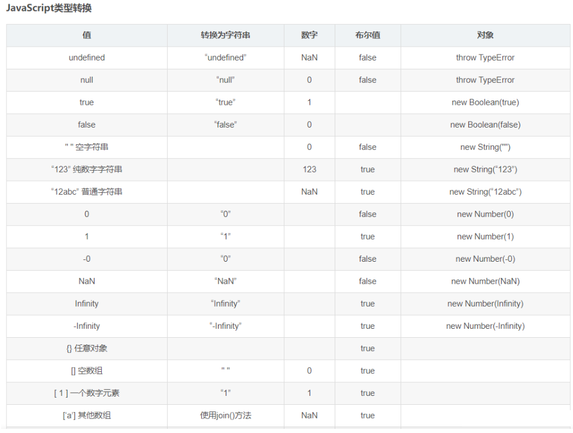

<!-- @import "[TOC]" {cmd="toc" depthFrom=1 depthTo=6 orderedList=false} -->


<font size=10 color=#F28D8D>Me and my code for those things</font>

# JavaScript 
## 简介
### 语言介绍
#### 什么是js？什么时候用？为什么要用？
### 使用到html
#### 如何将js应用到html页面
1. 外部引用
```
<script src="js/calculator.js"></script>
```

2. 内嵌
```
<script>
code
</script>
```

3. 行内
```
<button onclick="alert('hello')">button</button>
```

## 基本语法
### 变量
1. 声明变量 var let*
2. 初始化
3. 使用表达式
4. 输出结果到html
	1. alert()
	2. console.log()
	3. document.write() //dw

|  表头   | 表头  |
|  ----  | ----  |
| 单元格  | 单元格 |
| 单元格  | 单元格 |
| 单元格  | 单元格 |
| 单元格  | 单元格 |

### 数据类型
1. 数值型
2. 字符型 ES6字符串使用*
3. 对象
4. 布尔，null，未定义，……

### 数据类型转换
1. 自动转换


2. 强制转换
	1. 转换为数字
	Number(val)、NaN、parseInt/parseFloat、val*1
	2. 字符串转换
	String(val)、val.toString()、""+val

## 流程控制
### 分支结构
1. if
2. switch
### 循环结构
1. while/do-while*
2. for循环
	1. for-i
	2. for-in
	3. for-of
	4. each*
	
## 函数/方法
### 自定义函数
1. 基本语法 声明关键字
2. 参数列表
3. 返回值

### 系统函数
#### 数学函数
#### 字符函数
#### 时间日期函数
#### eval()*
## 面向对象*

## BOM和DOM
### BOM概念
### 常用属性、函数
### DOM概念
### 常用属性、函数

## 项目
### [贪吃蛇](https://awdcced.github.io/Snakes.html)
