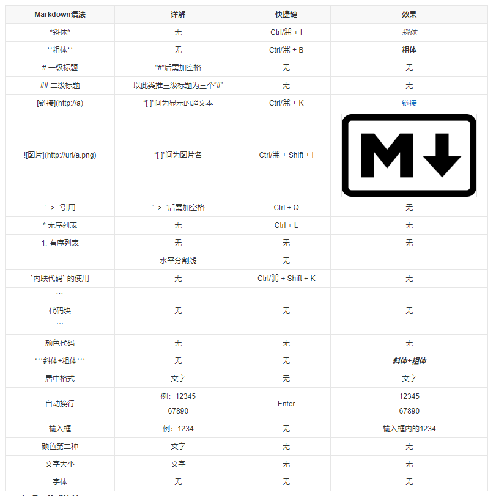

1. 自动转换

2. 强制转换
	1. 转换为数字
	Number(val)、NaN、parseInt/parseFloat、val*1
	2. 字符串转换
	String(val)、val.toString()、""+val

# 流程控制
## 分支结构
1. if
2. switch
## 循环结构
1. while/do-while*
2. for循环
	1. for-i
	2. for-in
	3. for-of
	4. each*
	
# 函数/方法
## 自定义函数
1. 基本语法 声明关键字
2. 参数列表
3. 返回值

## 系统函数
### 数学函数
### 字符函数
### 时间日期函数
### eval()*
# 面向对象*

# BOM和DOM
## BOM概念
## 常用属性、函数
## DOM概念
## 常用属性、函数

# 项目
## 贪吃蛇
